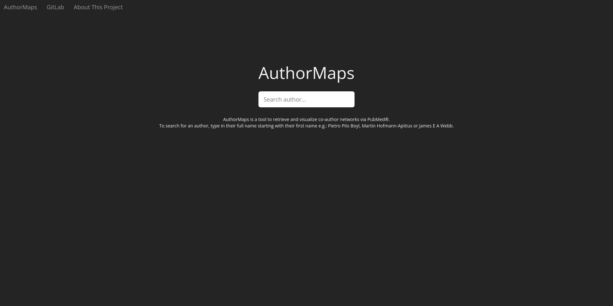
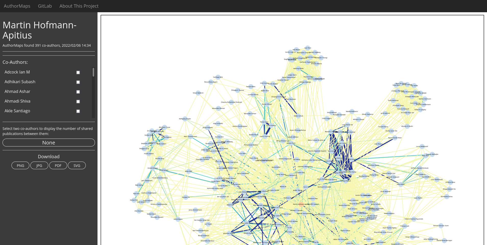

# AuthorMap

**Goal**

The primary goal of this project is to create a pipeline that generates a "co-author" network which details how strongly connected
the queried author is to his/her co-authors.

**Highlights of tasks**
1. Extract all publications for a given author using PubMed or PMC and compile a list of co-authors, i.e. other authors listed
on their publications

    API Usage: API : Bio Module,('https://eutils.ncbi.nlm.nih.gov/entrez/eutils/esearch.fcgi?db=pubmed&term={self.lastname}+{self.firstname}%5Bauthor%5D&retmax=9999')
    - **Note:** We limit the publications of author to 1000. The publications with more than 50 co-authors are not considered.

        **Reason:** Slow responding NCBI server for large amount of data.

2. Count occurrences of pairs of authors to quantify the number of publications that any pair of author both appear on
3. Generate a network depicting how strongly related every pair of authors are
4. Create a frontend which allows one to generate a co-author network for a given author name

- [Contributors](#contributors)
- [Installation & Configuration](#installation-configuration)
  - [Package](#package)
  - [Docker](#docker)
  - [Docker-Compose](#docker-compose)
- [Requirements](#requirements)
- [Usage](#usage)
    - [Command Line Interface](#command-line-interface)
        - [Examples: Graphical User Interface](#examples-graphical-user-interface)
    - [Graphical User Interface](#graphical-user-interface)
        - [Examples: Graphical User Interface](#examples-graphical-user-interface)
- [Testing](#testing)
- [Contributors](#contributors)

## Contributors

Tasks | Task List |  Assignee | Contribution
---:|:---:|:---:| ---
**Task 1** |Finding the Shared Work for One Author| Dhwani Solanki, Jackrite To | Backend development
**Task 2** |Finding the Shared Work for All-Pairs of Authors| Jackrite To, Sanjana Srinivasan | Backend development
**Task 3** |Count Em Up | Jackrite To, Sanjana Srinivasan, Zexin Li | Backend development
**Task 4** |Build a Network | Zexin Li | Backend development
**Task 5** |GUI | Justus Bisten | Frontend development
**Task 6** |Containerize the Application | Justus Bisten | Docker and Package

Please refer [Contribution.md](Contribution.md) for more details about each group members's work.


## Installation & Configuration

Clone the git repository.  
`git clone https://github.com/zli9/AuthorMap.git`

### Package

Commands for the package installation.
`cd group_2`  
`pip install authormaps_pkg/`  

Commands for starting the frontend/GUI  
`cd authormaps_frontend`   
`python run.py`  

The frontend will be running on
`http:\\localhost:8080`  

### Docker

Commands for installing the docker image
`cd AuthorMap`   
`sudo docker build --no-cache -t authormaps-test --build-arg FLASK_PORT=8080 .`  
The --build-arg FLASK_PORT determines on which port the flask application will be running on (default 8080).  

Commands for running the docker image  
`sudo docker run --name authormaps -p 8080:8080 -d authormaps-test`  
Keep in mind to map the port on which you want to access the frontend on to the one that you specified in the --build-arg (default 8080)  

By default the GUI will run on  
`http:\\localhost:8080`

### Docker-Compose
You can specify the FLASK_PORT in the .env file  
`cd AuthorMap`  
`vim .env`  

Commands running the docker-compose  
`cd AuthorMap`   
`sudo docker-compose up -d`  

By default the GUI will run on  
`http:\\localhost:8080`  


## Requirements

All the requirements of python libraries are listed in `setup.py`.

## Usage

### Command Line Interface(CLI)
The package supports listed CLI commands:

- **CLIs for TASK 1&2**

  - `getpubmedidlist` - get the list of PMIDs of publications for queried author.
  - `coauthorslist` - get the list of co-authors for queried author's publication.
  - `get_publicalistfiltered`- get the coauthors list filtered only for first author query to handle name collisions and download cachefiles.
  - `get_every_author_connection`-get the dictionary containing list of publications for every pair of authors


  <br>
- **CLIs for TASK 3**

  - `create` - create a network
  - `compile` - Calculate how many shared publications


#### Examples: Command Line Interface
**TASK 1 & 2**
```
> authormaps getpubmedidlist "Srinivasan" "Sanjana"
['34754938', '34062049', '34039636', '33745946', '32359397', '31316073', '30979825', '30753823', '28847755', '28119278']
```
```
> authormaps coauthorslist "Bajorath" "Jurgen" "33846469"
['Feldmann Christian', 'Bajorath Jurgen']
```
```
> authormaps get_publicalistfiltered "srinivasan" "sanjana"

Co-author list: ['Srinivasan Sanjana', 'Carugo Alessandro', 'Tripathi Durga N', 'Blando Jorge', 'Soeung Melinda', 'Baum Miranda L', 'Zhang Li', 'Shan Mengrou', 'Bristow Chris', 'Lang F
rederick F', 'Heffernan Timothy P', 'Sulman Erik P', 'Thompson Timothy C', 'Rose Johnathon', 'Shaheen MennatAllah', 'Roszik Jason', 'Minelli Rosalba', 'Yao Hui', 'Davidson Irwin', 'Sch
lacher Katharina', 'Deribe Yonathan Lissanu',...]
```
```
> authormaps get_every_author_connection "srinivasan" "sanjana"

 {('Dasgupta Pushan', 'Carbone Federica'): ['34039636'], ('Dasgupta Pushan', 'Yu Fei'): ['34039636'],
  ('Karam Jose A', 'Shapiro Daniel D'): ['32359397', '32947306', '32600535', '34885132', '34301458', '32033671', '34551888', '32623821']...}


```


**TASK 3 & 4**

For example, we want to create a network of an author `Bruce Schultz`

Users can specify the resolution by `--dpi` and whether to print number of shared publication as edge labels by flag `-b`. Note that the output network should be either .pdf, .svg, .png, or .jpg.

```
> authormaps create Bruce Schultz ./network.pdf --dpi 300
```

For example, we want to see the number of shared publication of `Manuel Peitsch` and `Julia Hoeng` in `Bruce Schultz`'s network.
Users can also specify the path to save node-link format json file by `-o` option.
```
>authormaps compile Bruce Schultz -a1 'Manuel Peitsch' -a2 'Julia Hoeng'
```


### Graphical User Interface

You can search Authors via the Graphical User Interface.

- Enter the authors full name. Start with the first name, then middle names, then last name (e.g. `Martin Hofmann-Apitius`)
- Separate first, middle, and last names with one space each
- Some authors abbreviate their middle names with the respective first letter of the name
- Please let search requests finish before entering a new one
- Substitue special characters (ÜäöÖÄß) with their respective counterparts (AUua)




You will be redirected to the search result page after the search request is finished.
- All co-authors of the queried author will be displayed in a alphabetically sorted scrollable list
- You can select two co-author checkboxes to get the shared publications between those authors
- AuthorMaps may suggest similiar named Authors for future search requests
- You can choose to download the displayed network graph in high resolution by clicking on one of the downloadformats below.


